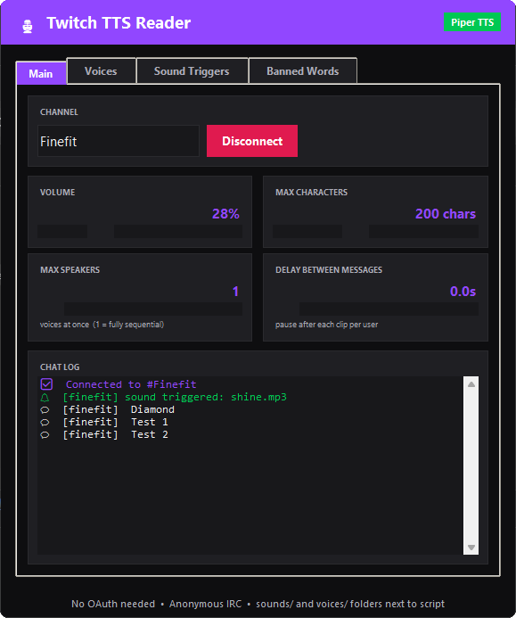

#  Speak My Chat!
### simple, enter a channel, hit connect, done. ݁




(Also Setup banned words)
---

## -=< download >=-

**just want to run it?**
grab the exe from [Releases](../../releases) — it'll create the `voices/` and `sounds/` folders automatically on first launch. no install, no setup.

**want to run from source?**
```
pip install piper-tts gtts pygame-ce
python main.py
```


SMC uses **piper-tts** for offline neural voices. each chatter gets one assigned randomly when they first speak.

**to add voices:**
1. download `.onnx` + `.onnx.json` pairs from the [piper releases page](https://github.com/rhasspy/piper/releases)
2. drop both files into the `voices/` folder next to the exe
3. restart the app — it'll pick them up automatically

**recommended models** ✦
- `en_US-lessac-medium`
- `en_US-amy-medium`
- `en_GB-alan-medium`


## -=< sound triggers ✦ >=-

play a sound effect when a keyword appears in chat.

1. drop `.mp3 / .wav / .ogg` files into the `sounds/` folder
2. open the **Sound Triggers** tab in the app
3. map a keyword → filename

the sound plays before the message is read out. matching is case-insensitive substring so `diamond` catches `DIAMOND`, `diamonds`, etc.
---


## -=< license ✦ >=-
MIT — [finefit](https://finefit.dev) 2026 ݁˖
